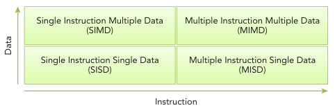
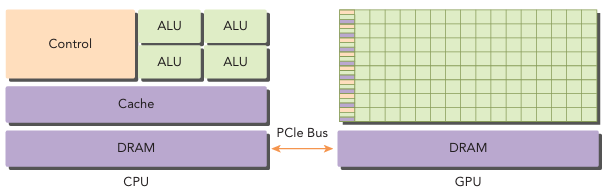

## Flynn's Taxonomy(플린의 분류법)

### Single Instruction Single Data (SISD)
SISD는 전통적인 컴퓨터이다. 컴퓨터에 오직 하나의 코어만 존재한다. 어느때든 하나의 명령 스트림을 실행하고, 하나의 데이터 스트림에 대해 작동된다.
### Single Instruction Multiple Data (SIMD)
SIMD는 병렬 아키텍쳐의 한 종류이다. 컴퓨터에 여러개의 코어가 존재한다. 모든 코어는 동일한 명령 스트림을 실행하며, 각 실행은 다른 데이터 스트림에 대해 작동한다. Vector Computer가 SIMD의 한 종류이며, 최신 컴퓨터들이 SIMD 아키텍쳐를 따르고 있다. SIMD 구조 연산 장치의 대표적인 예가 GPU이다.

### Multiple Instruction Single Data (MISD)
MISD는 여러개의 명령 스트림이 동일한 데이터 스트림에서 실행되며, 아직 실현되지 않은 컴퓨터 아키텍쳐이다.

### Multiple Instruction Multiple Data (MIMD)
MIMD는 여러 명령 스트림이 여러개의 데이터 스트림에 대해 실행되는 컴퓨터 아키텍쳐이다. 많은 MIMD 아키텍쳐가 SIMD를 서브 컴포넌트로 가지고 있다.

## Hetergeneous Architecture 

전형적인 이종(Hetergeneous) 컴퓨터들은 멀티코어 CPU와 두개 이상의 코어를 가진 GPU들로 구성된다. GPU는 standalone한 플랫폼이 아니며 CPU의 co-processor이다.
따라서 GPU는 CPU-based인 Host와 PCI-Express bus를 통해 연결되어 작동해야한다. 이것이 GPU 컴퓨팅 용어에서 CPU를 Host라고 부르고, GPU를 Device라고 부르는 이유다.

 

Host 코드는 CPU에서 실행되고, Device 코드는 GPU에서 실행된다. 이종 플랫폼에서 실행되는 어플리케이션은 일반적으로 CPU에 의해 시작된다. CPU코드는 환경, 코드, device에서 실행되기 위한 데이터를 관리하는 역할을 맡는다.

연산량이 많은 프로그램에서 데이터를 병렬화한다. GPU는 이러한 데이터 병렬처리를 가속화하는데 사용하며 하드웨어 가속기(hardware acclerator)라고 부른다.